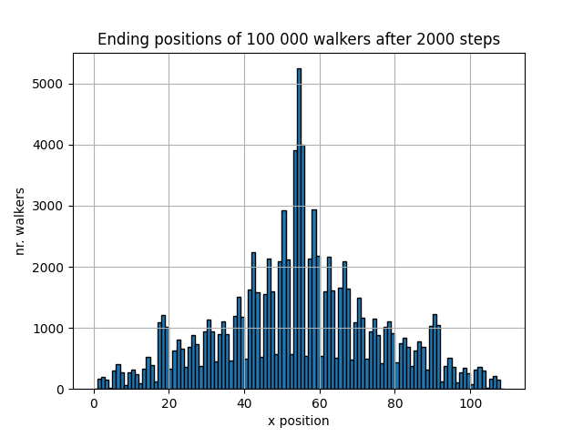
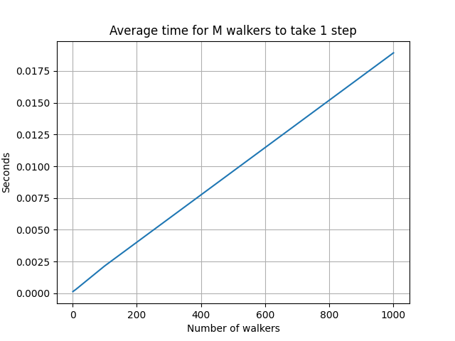

# H23_project3_kjesta
## Project 3 for kjesta (kjesta@mail.uio.no)

- Repo url : https://github.uio.no/IN1910/H23_project3_kjesta

## Authors

- Kjersti Stangeland (kjesta@geo.uio.no)

### Answers to task 1c)
Mean displacement at time step $n$ is given by
$$
    \langle x_n \rangle = \sum_{i=1}^{n} \langle \Delta x_i \rangle,
$$
$$

    \langle \Delta x_i \rangle = \sum_{\alpha} = p^{\alpha}\Delta x^{\alpha} = \frac{1}{3} (-1) + \frac{1}{3} (0) + \frac{1}{3} (1) = 0
$$
while the RMS is given by
$$
     \sqrt{\langle x_n^2 \rangle} = \sqrt{(\sum_{i=1}^{n}\langle \Delta x_i )^2\rangle } = \sqrt{\sum_{i=1}^n \langle\Delta x_i^2\rangle + 2 \sum_{i<j}\langle \Delta x_i  \Delta x_j \rangle} =
$$
$$ 
      \sqrt{\sum _{i=1}^{n}(\frac{1}{3}(-1)^2+\frac{1}{3}(0)^2 + \frac{1}{3}(1)^2) + 0} = \sqrt{\frac{2n}{3}}.
$$

### Answers to task 1d)
- The plot "statistical_1D.png" shows that the law of large numbers holds. The calculated values from the random walks gets closer to the analytical solution as numbers of walkers increases. With M = 1000, the calculated value does not deviate too much from the analytical value, and seems to develop in the same nature.

### Answers to task 2c)
Mean displacement at time step $n$ is given by
$$
\langle \vec r_n \rangle = (\langle x_n \rangle, \langle y_n \rangle) = (\sum_{i=1}^{n} \langle \Delta x_i \rangle, \sum_{i=1}^{n} \langle \Delta y_i \rangle) =
$$

$$
 \sum_{i=1}^{n}( \frac{1}{6} (-1) + \frac{1}{6} (0) + \frac{1}{6} (1),  \frac{1}{6} (-1) + \frac{1}{6} (0) + \frac{1}{6} (1)) = (0,0)
$$

while the RMS is given by

$$
\sqrt{\langle \lvert \vec r_n \rvert^2 \rangle} = \sqrt{\langle x_n ^2 \rangle + \langle y_n ^2 \rangle} = \sqrt{(\sum_{i=1}^{n} \langle \Delta x_i ^2\rangle + \sum_{i=1}^{n} \langle \Delta y_i ^2 \rangle)} 
$$

$$
= \sqrt{\sum_{i=1}^n((\frac{1}{6} (-1)^2 + \frac{1}{6} (0)^2 + \frac{1}{6} (1)^2) + (\frac{1}{6} (-1)^2 + \frac{1}{6} (0)^2 + \frac{1}{6} (1)^2))}
$$

$$
= \sqrt{\frac{2n}{3}} .
$$

### Answer to task 2d)
The plot in figure "ending_positions_2D.png" shows that the ending positions of 1000 random walkers are concentrated around the expected position (0,0). The ending positions are located around (0,0) as a sphere, with decreasing concentration with increasing radii. 

### Answer to task 3h)
56316 walkers reached an end point. Ending positions of 100 000 walkers after 2000 steps resembles a normal distribution on the x-axis, as the CLT says. Most of the walkers ended on a x-position around 54. 

### Answer to task 4a)
Given the figure below, the time complexity of taking a single step goes as O(M) in big Oh notation. The runtime increases linearly with increasing amount of walkers. If the M walkers were to walk the whole maze, taking N steps: $$ N*M = O(NM)$$.

### Answers to task 4b)
- "Tottime" is the total time spent inside a method/function, excluding any calls to other methods within the method. "Cumtime" on the other hand is the cumulative time spent within a method, including the time spent for calling other methods from the given method. So if you're i one function doing some stuff, needing to call another function and running that , the "tottime" does not include the time calling another function as time spent in the function. If a method/function does not call any other methods/functions, "tottime" and "cumtime" will be the same. 
- The top three methods that spend the most time is 
  - def not_finished(), where it seems to use quite some time to check if the positions of the M walkers are in fact a endpoint. 
  - def move(), has a high cumtime due to its call to not_finished, but regardless also has the second highest tottime. 
  - def _remove_illegal(), has no function calls, and is the third most time consuming method. 

  I think that when listing the top three most time consuming methods one should look at the tottime, because this is the one showing whether that method is implemented in a smart way. I think my move method improved alot by vectorization, but has a large cumtime because its calling the not_finished method which clearly could be improved time-wise. 

  - The cprofiler results indicates that at least the not_finished method can be improved, because it is sinking the whole program. I started off by havig that method implemented with a for-loop, and later changed to a vectorized method because I realized in 3h) that with non-vectorized and a call from inside the move function, it had to iterate all the positions, 100_000 of them, for each step. As of right now, I would need alot more time to see how I can improve it further. 

### Comments
- The animation in task 3h) took 1.5 hours to complete, even after vectorizing the most important methods. 
- This README file looks good in the preview section in VScode, but I notice that it doesnt get rendered correctly when pushing to github. Especially the mathematical formulas. 
